# macOS 开发环境

[官方macOS安装教程](https://flutter.cn/docs/get-started/install/macos) 不适合国内网络环境，并且对新手不够友好，本文致力于解决这两个问题。

文中的网址 `flutter.cn` 为 `国内镜像站点`，将其替换为 `flutter.dev` 即可进入官方站点（需科学上网）。

## Android Studio 安装

1、下载 [Android Studio](https://developer.android.google.cn/studio) 并安装运行，如果提示 `Unable to access Android SDK add-on list` 直接点击 `Cancel` 跳过

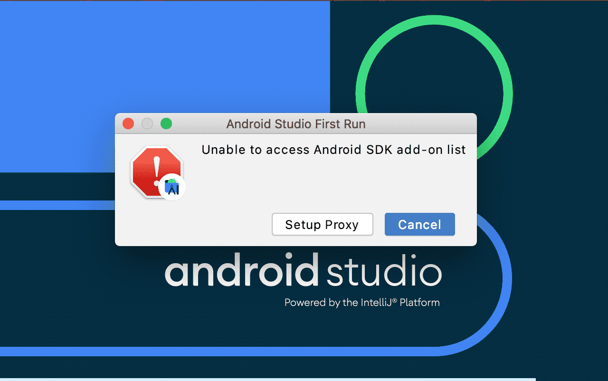

2、下面是 `Android Studio` 初次启动的设置：

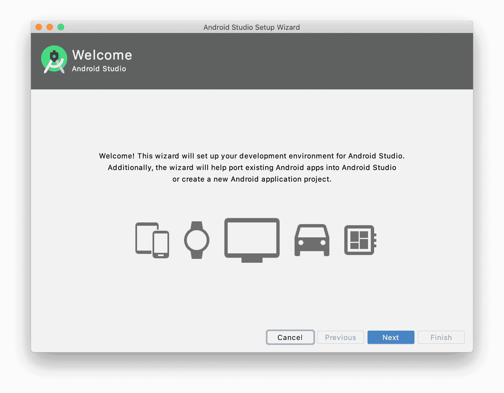

选择安装方式

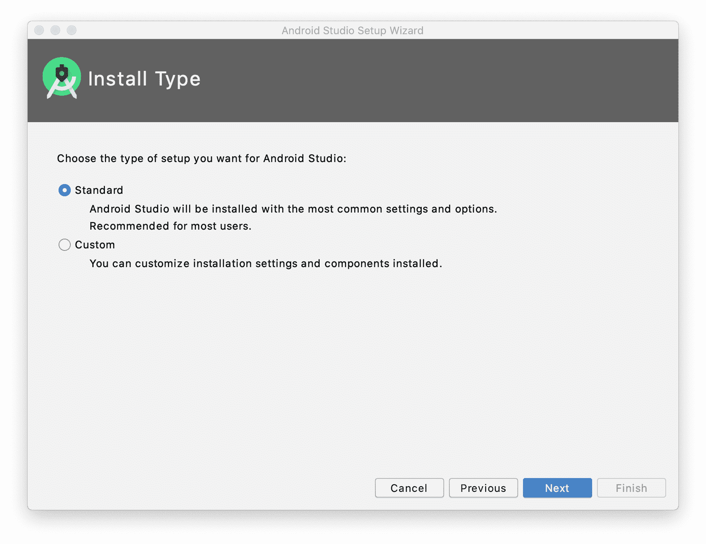

选择Theme

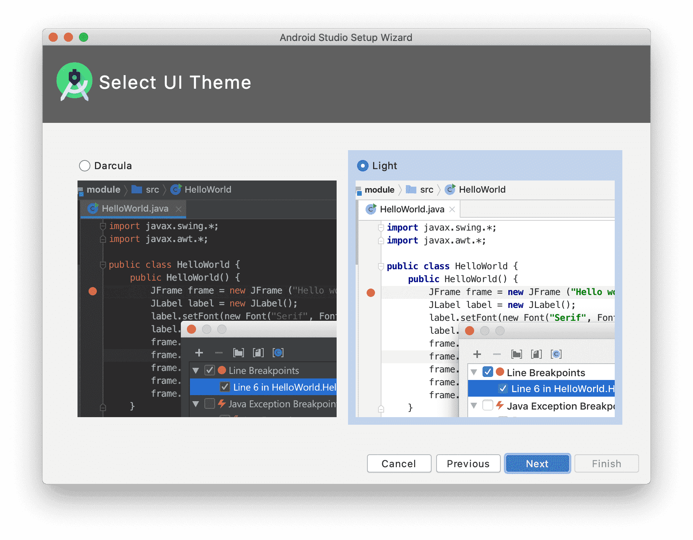

如果SDK下载失败也没关系，可以在之后设置国内代理重新下载


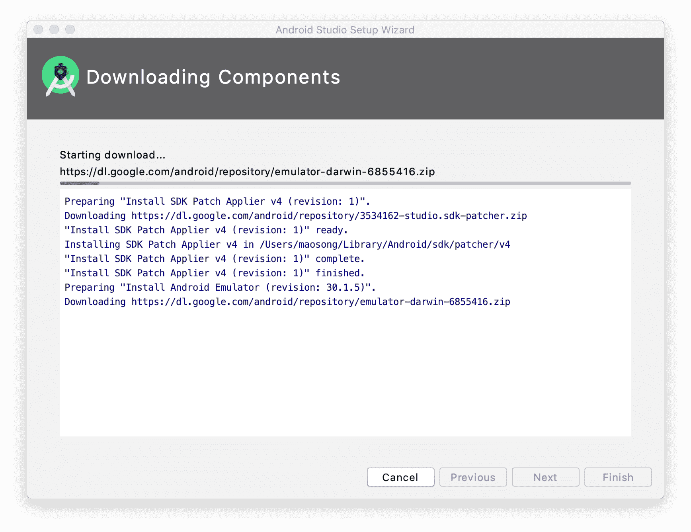

安装 `HAXM` 时需要输入管理员密码

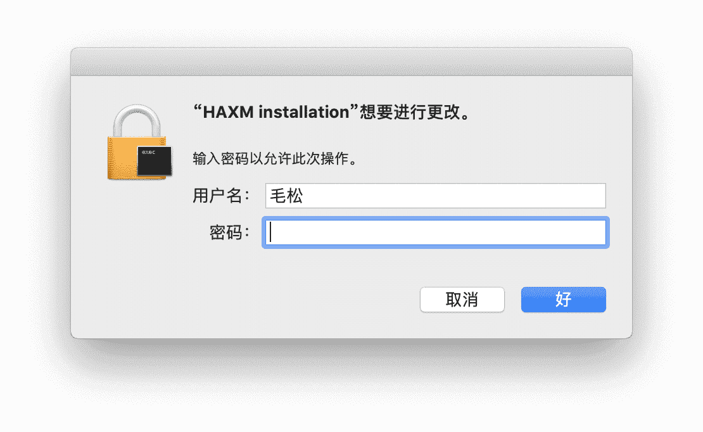

3、如果SDK下载失败，请根据下图设置国内代理重新下载

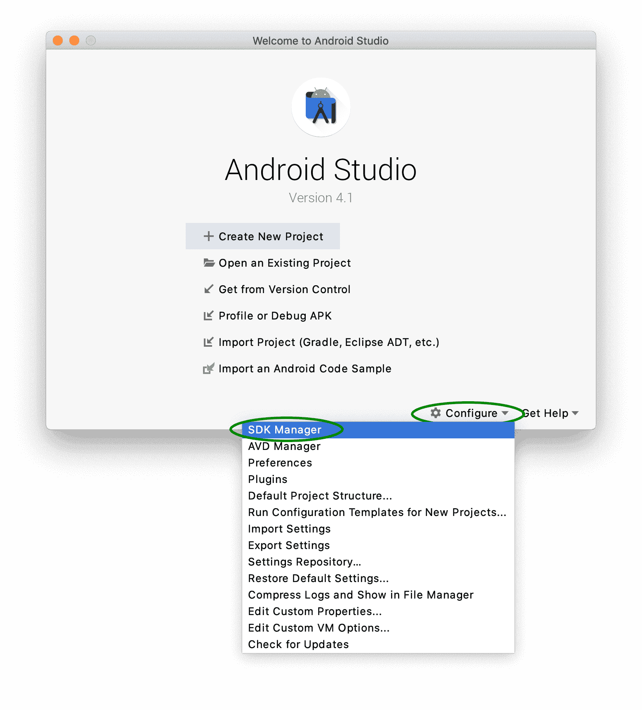

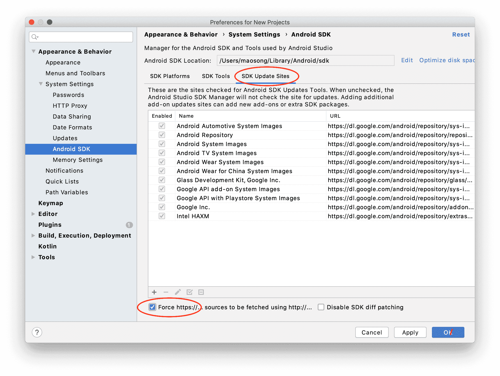

代理网址：http://mirrors.neusoft.edu.cn/

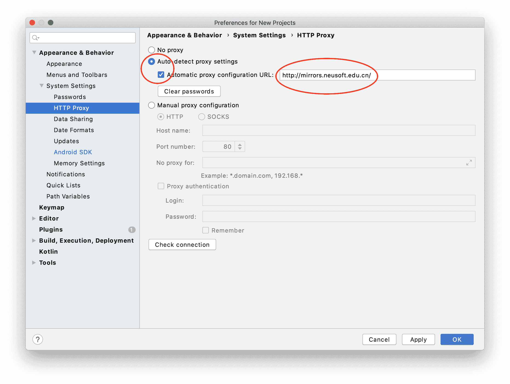

设置代理后，根据下图选择需要下载的SDK：

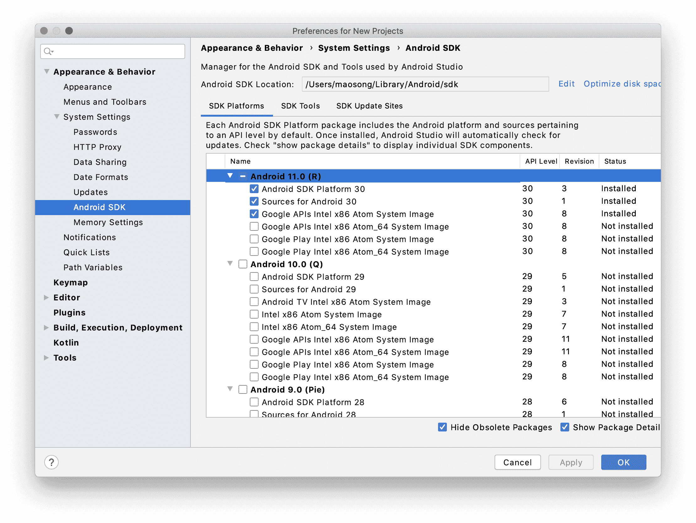

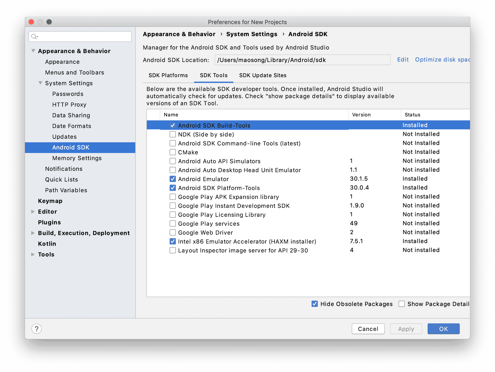

4、修改 `~/.zshrc` 文件添加以下命令，为 `Platform Tools` 设定 `PATH`：

```bash
# Platform Tools
export PATH=~/Library/Android/sdk/platform-tools:$PATH
```

## Android Studio 插件

如果你希望通过 `Android Studio` 开发 `Flutter` 应用，可以按下图安装插件：

!> macOS版本 `Android Studio` 安装插件之前请 `关闭` 上文中提到的国内代理，否则无法搜索

!> 如果插件下载失败多试几次就可以，或者直接科学上网

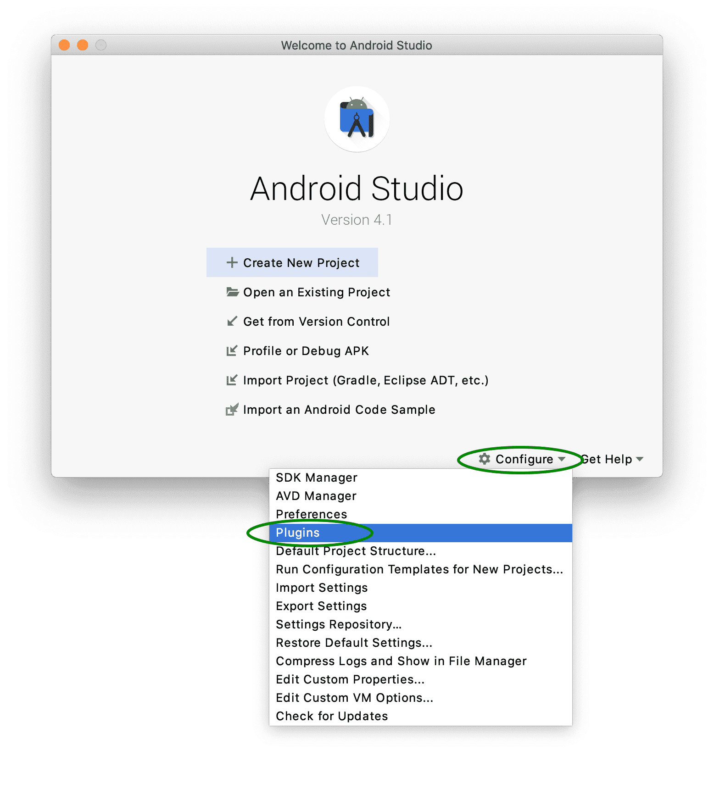

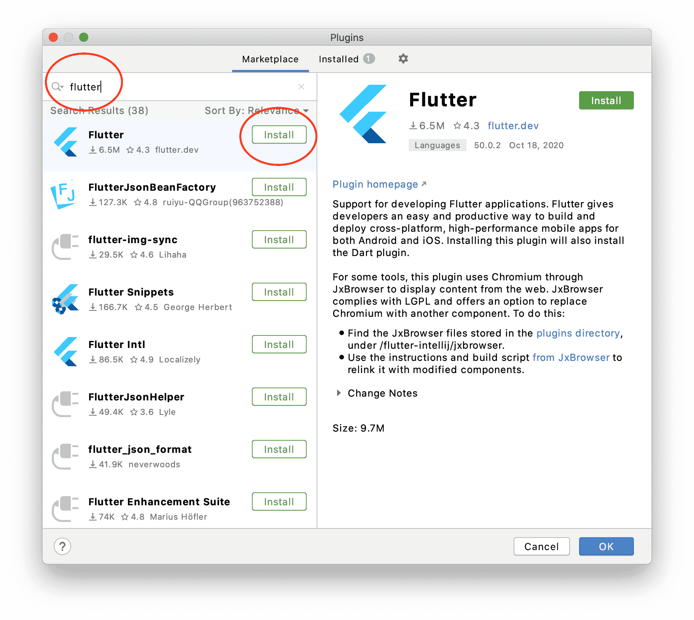

## Visual Studio Code 插件

`Android Studio` 非常消耗系统资源，如果你的内存较少建议使用 `Visual Studio Code` 进行开发，`Flutter` 对其支持非常友好。以下是需要安装的插件：

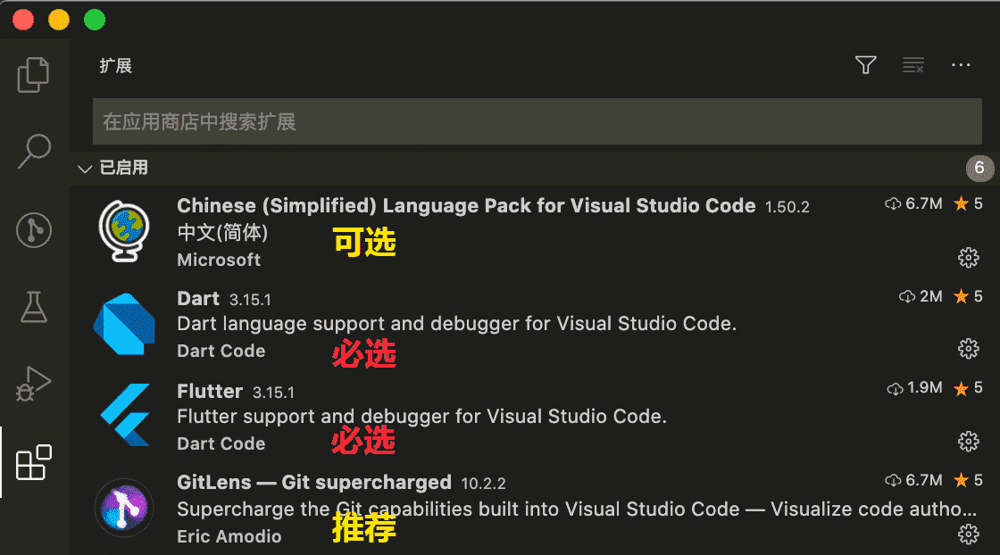

下面是 `Dart` 插件的配置：

```json
{
  "debug.openDebug": "openOnDebugBreak",

	"[dart]": {
		// Automatically format code on save and during typing of certain characters
		// (like `;` and `}`).
		"editor.formatOnSave": true,
		"editor.formatOnType": true,

		// Draw a guide line at 80 characters, where Dart's formatting will wrap code.
		"editor.rulers": [80],

		// Disables built-in highlighting of words that match your selection. Without
		// this, all instances of the selected text will be highlighted, interfering
		// with Dart's ability to highlight only exact references to the selected variable.
		"editor.selectionHighlight": false,

		// By default, VS Code prevents code completion from popping open when in
		// "snippet mode" (editing placeholders in inserted code). Setting this option
		// to `false` stops that and allows completion to open as normal, as if you
		// weren't in a snippet placeholder.
		"editor.suggest.snippetsPreventQuickSuggestions": false,

		// By default, VS Code will pre-select the most recently used item from code
		// completion. This is usually not the most relevant item.
		//
		// "first" will always select top item
		// "recentlyUsedByPrefix" will filter the recently used items based on the
		//     text immediately preceding where completion was invoked.
		"editor.suggestSelection": "first",

		// Allows pressing <TAB> to complete snippets such as `for` even when the
		// completion list is not visible.
		"editor.tabCompletion": "onlySnippets",

		// By default, VS Code will populate code completion with words found in the
		// current file when a language service does not provide its own completions.
		// This results in code completion suggesting words when editing comments and
		// strings. This setting will prevent that.
		"editor.wordBasedSuggestions": false,
  }
}
```

## Flutter SDK 安装

1、下载 [最新版SDK](https://flutter.cn/docs/get-started/install/macos#get-sdk)，也可以下载 [历史版本](https://flutter.cn/docs/development/tools/sdk/releases?tab=macos)。

2、解压缩 `flutter_macos_1.22.2-stable.zip` 到任意文件夹。

3、修改 `~/.zshrc` 文件添加以下命令，为 `Flutter` 设置 `PATH`

```bash
# Flutter
export PATH=/PATH/TO/flutter/bin:$PATH
```

4、执行如下命令，接受 Android Licenses，当提示是否接受许可时输入 `y`

```bash
$ flutter doctor --android-licenses
```

5、为 `Flutter` 设置 `国内镜像`

5.1、修改 `~/.zshrc` 文件添加以下命令

```bash
# Flutter
export PUB_HOSTED_URL=https://pub.flutter-io.cn
export FLUTTER_STORAGE_BASE_URL=https://storage.flutter-io.cn
```

5.2、修改 `/PATH/TO/flutter/packages/flutter_tools/gradle/flutter.gradle`

5.2.1、 注释掉 `google()` 和 `jcenter()` 更改为

```gradle
maven { url 'https://maven.aliyun.com/repository/google' }
maven { url 'https://maven.aliyun.com/repository/jcenter' }
maven { url 'http://maven.aliyun.com/nexus/content/groups/public' }
```

5.2.2、找到 `https://storage.googleapis.com` 修改为 `https://storage.flutter-io.cn`

6、最后执行如下命令，检查 Flutter 安装情况：

```bash
$ flutter doctor
```

```text
Doctor summary (to see all details, run flutter doctor -v):
[✓] Flutter (Channel stable, 1.22.2, on Mac OS X 10.15.7 19H2, locale zh-Hans-CN)
[✓] Android toolchain - develop for Android devices (Android SDK version 30.0.2)
[✓] Xcode - develop for iOS and macOS (Xcode 11.6)
[!] Android Studio (version 4.1)
    ✗ Flutter plugin not installed; this adds Flutter specific functionality.
    ✗ Dart plugin not installed; this adds Dart specific functionality.
[✓] VS Code (version 1.50.1)
[!] Connected device
    ! No devices available

! Doctor found issues in 2 categories.
```

一般来说会出现的两处问题：

- 虽然 `Android Studio 4.1` 已经正确配置，但依然提示找不到 `Flutter` 和 `Dart` 插件，预计 `Flutter 1.23` 会解决此BUG
- `No devices available` 是因为没有通过USB连接手机，或者未启动 Android/iOS 仿真器

## Flutter SDK 升级

可以通过如下两种方式升级：

- 删除原文件夹，重新下载 [最新版SDK](https://flutter.cn/docs/get-started/install/macos#get-sdk)
- 执行如下命令自动升级，`--force` 参数会忽略本地修改（flutter.gradle）强制从 GitHub `pull` 新版

```bash
$ flutter upgrade --force
```

无论使用哪种方式，升级完毕后需要重新修改 `/PATH/TO/flutter/packages/flutter_tools/gradle/flutter.gradle` 文件。

## Gradle 手动安装

`Gradle` 是优秀的自动化构建工具，`Android Studio` 会根据项目配置 `android/gradle/wrapper/gradle-wrapper.properties` 自动下载对应的版本，虽然 `Gradle` 启用了中国地区的CDN，但某些网络环境下载还是很慢。

另外，根据 `Android Stuido` 的机制，如果 `Gradle` 某一版本下载中断 `.lock ` 并不会被删除，不进行手动处理该版本将永远不可用。

解决方案如下：

1. 切换其他网络（如手机4G/5G）复制 `gradle-wrapper.properties` 中的 `distributionUrl` 直接下载，或者从他人电脑复制。
2. 下载完毕后复制 zip 文件到 `~/.gradle/wrapper/dists/gradle-x.x.x-xxx/随机字符串`（`随机字符串`文件夹是之前下载失败时创建的）
3. 手动解压缩 zip 文件
4. 在项目文件夹运行如下命令

```bash
$ flutter clean
```

5. 重新启动项目即可

## 扩展阅读

- [官方macOS安装教程](https://flutter.cn/docs/get-started/install/macos)
